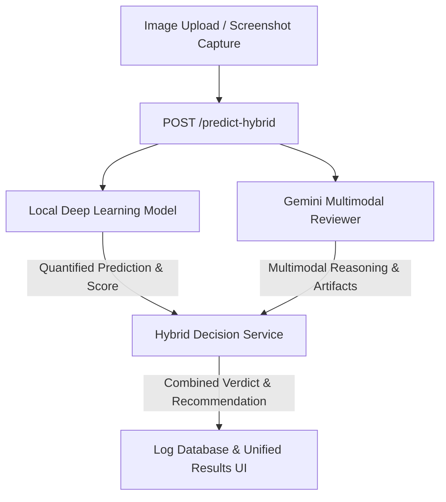

# Hybrid AI Image Detection System

This document describes the design, architecture, decision matrix, and developer specifications for the **Dual-Tier Hybrid AI Image Detection System** in this project. By integrating a high-performance local PyTorch model with Google's state-of-the-art Gemini multimodal reasoning engine (via the modern `google-genai` SDK), the system provides extremely robust, explainable, and context-aware predictions.

---

## 1. Architectural Overview

The system evaluates uploaded images (or captured screenshots) using a two-layered grading process:



1. **Tier 1: Local Machine Learning Model**
   - **Type**: Self-trained PyTorch neural network.
   - **Output**: Quantified probability percentages for `FAKE` (AI-Generated) and `REAL` (Authentic).
   - **Characteristics**: Low-latency, deterministic, based on learned texture anomalies.

2. **Tier 2: Gemini Multimodal Reviewer**
   - **Type**: `gemini-2.5-flash` model via the modern `google-genai` SDK.
   - **Output**: Qualitative predictions, reasoning summary, visual signals, and image limitations.
   - **Characteristics**: High-level semantic reasoning, expert secondary opinion, and detailed human-readable explanations.

---

## 2. API Specification: `POST /predict-hybrid`

### Request Configuration
- **Endpoint**: `POST /predict-hybrid`
- **Security**: Bearer JWT Token required (`Authorization: Bearer <TOKEN>`)
- **Content-Type**: `multipart/form-data`

### Form Fields
- `file` (Binary File): The image payload (JPEG, PNG, or WEBP).
- `use_gemini` (Boolean String, e.g., `"true"`): Enable or disable Gemini double-verification.
- `source_type` (String, e.g., `"upload"`, `"screenshot"`, `"url"`): Track where the image originated.

### Response Schema (`HybridPredictionResponse`)
```json
{
  "final_decision": "UNCERTAIN",
  "agreement_status": "disagree",
  "local_model": {
    "predicted_label": "FAKE",
    "confidence": 0.885,
    "fake_probability": 0.885,
    "real_probability": 0.115,
    "model_name": "ResNet50_Detector",
    "processing_time_ms": 142
  },
  "gemini_analysis": {
    "predicted_label": "REAL",
    "confidence_level": "medium",
    "reasoning_summary": "Hình ảnh hiển thị nhiễu cảm biến hạt tự nhiên, không phát hiện sự bất đối xứng ở khớp tay hay hiện tượng trôi pixel của các mô hình khuếch tán.",
    "visual_signals": [
      "Natural camera grain",
      "Consistent shadows",
      "Correct anatomical details"
    ],
    "limitations": "Độ phân giải trung bình hạn chế phân tích mật độ nhiễu tinh vi.",
    "error": false
  },
  "recommendation": "Hệ thống không đồng thuận. Local Model nghi ngờ FAKE (88.5%) nhưng Gemini đánh giá REAL. Đề xuất hậu kiểm thủ công.",
  "image_url": "https://res.cloudinary.com/.../image.png",
  "thumbnail_url": "https://res.cloudinary.com/.../thumbnail.png",
  "cloudinary_warning": null
}
```

---

## 3. Decision Matrix & Conflict Resolution

The combining engine (`hybrid_decision_service.py`) resolves prediction agreements and discrepancies using the following strict logic rules:

| Tier 1 (Local Model) | Tier 2 (Gemini Reviewer) | Combine Rule / Condition | Final Verdict (`final_decision`) | System Agreement State (`agreement_status`) |
| :--- | :--- | :--- | :--- | :--- |
| **Label A** | **Label A** | Both systems match. | **Label A** | `agree` |
| **Label A** | **Label B** | Systems mismatch. | `UNCERTAIN` | `disagree` |
| **Label A** | *N/A (Disabled / Err)* | Local Model Confidence $\ge 0.70$ | **Label A** | `gemini_unavailable` |
| **Label A** | *N/A (Disabled / Err)* | Local Model Confidence $< 0.70$ | `UNCERTAIN` | `gemini_unavailable` |

### Expert Recommendations Generated
- **Agree FAKE**: *"Cả hai hệ thống đều nhận định ảnh giả lập AI (FAKE). Độ tin cậy cao. Tránh sử dụng ảnh này cho mục đích đòi hỏi tính xác thực cao."*
- **Agree REAL**: *"Cả hai hệ thống đều tin tưởng đây là ảnh chụp thực tế (REAL) với độ tin cậy tuyệt đối."*
- **Disagree / Conflict**: *"Hệ thống phát hiện mâu thuẫn giữa phân tích cấu trúc của mô hình học máy (Local) và ngữ cảnh ngữ nghĩa của Gemini. Cần kiểm tra kỹ các artifact thị giác thủ công."*
- **Gemini Unavailable / High Local Confidence**: *"Mô hình học máy cục bộ tự tin đưa ra dự đoán độc lập (Gemini tắt hoặc lỗi)."*
- **Gemini Unavailable / Low Local Confidence**: *"Mô hình học máy cục bộ không đủ tự tin và không có đánh giá từ Gemini. Kết quả không chắc chắn."*

---

## 4. Technical Implementation Details

### Gemini Integration (`gemini_service.py`)
Utilizes the official modern Google GenAI Client:
```python
from google import genai
from google.genai import types

client = genai.Client(api_key=settings.GEMINI_API_KEY)
```
Uses **Structured Output Schemes** (`response_schema`) to force the model to output strict Pydantic JSON structures directly:
```python
class GeminiAnalysisSchema(BaseModel):
    predicted_label: Literal["REAL", "FAKE", "UNCERTAIN"]
    confidence_level: Literal["high", "medium", "low"]
    reasoning_summary: str
    visual_signals: list[str]
    limitations: Optional[str] = None
```

### Database Storage Schema (`logging_service.py`)
Predictive records are stored inside the SQLite DB with 10 added tracking columns representing both models' variables. Dynamic migrations are executed automatically upon server boot. Visual signals are converted to JSON lists on output deserialization.

---

## 5. UI User Experiences

### A. Next.js Upload Panel
- Custom **Toggle switch** allows users to enable or disable Gemini double-verification dynamically.
- Interactive results show 3 layered layout cards:
  1. **Final Decision Box**: Displays verdict (FAKE/REAL/UNCERTAIN), agreement badges, and callout recommendations.
  2. **Local Model Analytics Card**: Progress bar breakdown of AI generated (Fake) and Authentic (Real) percentages.
  3. **Gemini Second Opinion Card**: Showcases reasoning summary in Vietnamese, visual signal bullet points, and limitations.

### B. Next.js History Panel
- Unified filters let users isolate results by FAKE, REAL, UNCERTAIN, Gemini Agreed, and Gemini Disagreed entries.
- Clicking any grid card triggers a premium floating **Report Modal** compiling full details, side-by-side local model vs Gemini comparative charts, and visual signals.

### C. Chrome Extension (Popup & Overlay)
- Popup integrates a slider switch for Gemini.
- Selection is passed in MV3 runtime messages (`START_CAPTURE_AREA`).
- When dragging and capturing a viewport region, the background worker routes requests to `/predict-hybrid`.
- The injected shadow DOM overlay compiles local scores, Gemini visual reasoning summary, lists signals, and recommendations natively in a floating card on the target web page.
