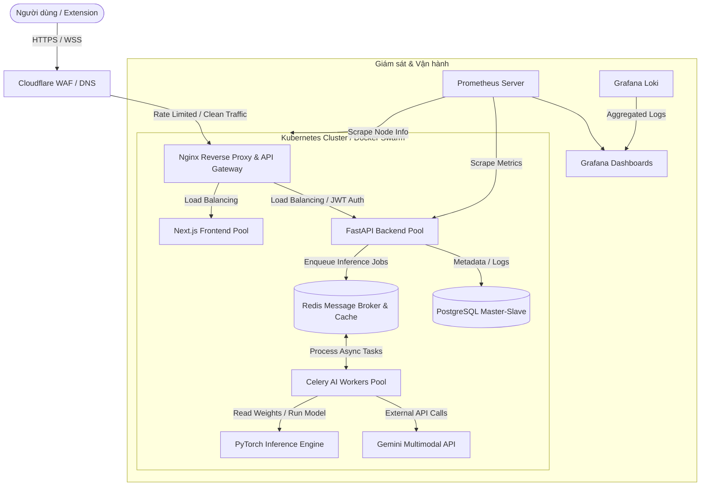
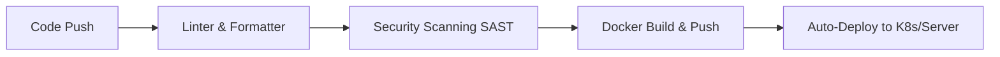

# TÀI LIỆU ĐỀ XUẤT NÂNG CẤP HẠ TẦNG, BẢO MẬT & UI/UX
## ĐỀ TÀI: HỆ THỐNG PHÁT HIỆN ẢNH GIẢ LẬP AI DỰA TRÊN HỆ THỐNG LAI KÉP (HYBRID DETECTOR)
---

Để biến dự án này thành một đồ án tốt nghiệp xuất sắc, đạt chuẩn **Hạ tầng mạng & Bảo mật (Infrastructure & Security Engineering)** chuyên nghiệp, hệ thống cần được nâng cấp toàn diện từ mô hình chạy đơn lẻ (Docker Compose cục bộ) lên một kiến trúc sẵn sàng cao (High Availability), có khả năng chịu tải tốt, bảo mật nghiêm ngặt và trực quan hóa giám sát.

Dưới đây là sơ đồ kiến trúc tổng thể sau khi nâng cấp hệ thống:



---

## PHẦN 1: BẢO MẬT & GIA CỐ HỆ THỐNG (SECURITY & HARDENING)

Đối với một đồ án hạ tầng, phần bảo mật phải được thiết kế theo nguyên tắc **Phòng thủ chiều sâu (Defense in Depth)** từ tầng biên (Edge) đến mã nguồn ứng dụng.

### 1. Giới hạn tần suất và chống DDoS (Rate Limiting & DDoS Prevention)
*   **Vấn đề hiện tại**: API `/predict-hybrid` gọi tới Gemini API tốn phí và tiêu tốn nhiều tài nguyên tính toán của mô hình nội bộ. Nếu kẻ xấu dùng script spam gửi hàng nghìn ảnh liên tục sẽ gây sập server và cạn kiệt ngân sách Gemini.
*   **Giải pháp nâng cấp kỹ thuật**:
    *   Tích hợp **Redis-based Rate Limiter** ở tầng API Gateway (Nginx) hoặc trực tiếp tại Middleware của FastAPI.
    *   *Cấu hình khuyến nghị*: Giới hạn 20 request/phút đối với User chưa định danh (IP-based) và 60 request/phút đối với User đã đăng nhập (Token-based).
    *   Áp dụng thuật toán **Token Bucket** hoặc **Leaky Bucket** thông qua thư viện `slowapi` trong FastAPI.

### 2. Tường lửa Ứng dụng Web (Web Application Firewall - WAF)
*   **Giải pháp nâng cấp kỹ thuật**:
    *   Triển khai **OWASP ModSecurity WAF** tích hợp vào Nginx Reverse Proxy.
    *   Cấu hình các bộ luật để lọc và chặn các cuộc tấn công phổ biến:
        *   **SQL Injection**: Ngăn chặn tấn công qua các tham số lịch sử `/history` và dữ liệu người dùng.
        *   **Path Traversal & LFI**: Chống khai thác qua đường dẫn upload ảnh để đọc trộm file hệ thống.
        *   **Malicious File Upload**: Giới hạn kích thước file upload (< 5MB), chỉ cho phép các MIME-type hợp lệ (`image/jpeg`, `image/png`, `image/webp`) và quét mã độc (ClamAV) trước khi lưu.

### 3. Bảo mật truyền thông và Cấu hình Nginx Hardening
*   **Giải pháp nâng cấp kỹ thuật**:
    *   Bắt buộc sử dụng **HTTPS** với chuẩn **TLS 1.3** duy nhất (vô hiệu hóa các phiên bản TLS cũ như 1.0, 1.1 để tránh tấn công hạ cấp bảo mật).
    *   Cấu hình các HTTP Security Headers nghiêm ngặt trong file cấu hình Nginx:
        ```nginx
        # Chống Clickjacking
        add_header X-Frame-Options "DENY" always;
        # Chống XSS Sniffing
        add_header X-Content-Type-Options "nosniff" always;
        # Ép trình duyệt sử dụng HTTPS (HSTS)
        add_header Strict-Transport-Security "max-age=63072000; includeSubDomains; preload" always;
        # Kiểm soát nguồn tài nguyên được tải (Content Security Policy)
        add_header Content-Security-Policy "default-src 'self'; script-src 'self' 'unsafe-inline'; style-src 'self' 'unsafe-inline' https://fonts.googleapis.com; img-src 'self' data: https://res.cloudinary.com;" always;
        ```

### 4. Cơ chế xác thực an toàn (Secure Authentication Architecture)
*   **Giải pháp nâng cấp kỹ thuật**:
    *   Chuyển đổi lưu trữ JWT từ LocalStorage (dễ bị tấn công XSS đánh cắp) sang **HttpOnly, Secure, SameSite=Strict Cookies**.
    *   Triển khai mô hình **Dual-Token System**:
        *   *Access Token*: Thời gian sống ngắn (15 phút), lưu trong memory/cookie.
        *   *Refresh Token*: Thời gian sống dài (7 ngày), lưu trong DB để cấp lại Access Token khi hết hạn.
    *   Phân quyền người dùng (RBAC - Role-Based Access Control) chặt chẽ giữa 3 nhóm: `Guest` (chỉ được xem demo/predict thử hạn chế), `User` (kiểm tra ảnh, xem lịch sử cá nhân), và `Admin` (cấu hình hệ thống, quản lý model, giám sát log bảo mật).

---

## PHẦN 2: KIẾN TRÚC HẠ TẦNG & SẴN SÀNG CAO (SCALABILITY & HIGH AVAILABILITY)

Để hệ thống xử lý AI vận hành mượt mà và không bị gián đoạn khi lượng truy cập tăng vọt.

### 1. Hàng đợi xử lý bất đồng bộ cho AI Inference (Asynchronous Task Queue)
*   **Vấn đề hiện tại**: Các mô hình PyTorch (EfficientNetV2, ConvNeXt, ResNet50) tiêu thụ CPU/GPU rất lớn. Chạy đồng bộ (Synchronous) trực tiếp trên luồng API FastAPI sẽ khóa toàn bộ worker (blocking), khiến các request khác phải xếp hàng chờ đợi dẫn đến lỗi `504 Gateway Timeout`.
*   **Giải pháp nâng cấp kỹ thuật**:
    *   Chuyển đổi toàn bộ luồng `/predict-hybrid` sang mô hình **Bất đồng bộ (Asynchronous Queue)** bằng **Celery** và **Redis/RabbitMQ**.
    *   *Quy trình hoạt động*:
        1. Người dùng upload ảnh -> FastAPI nhận file, lưu tạm vào Cloud Storage (Cloudinary/MinIO S3).
        2. FastAPI đẩy một Job (đường dẫn ảnh, tham số) vào Redis Queue và trả về ngay mã phản hồi `202 Accepted` kèm theo một `task_id`.
        3. Phía Frontend nhận `task_id` và thiết lập kết nối **WebSocket** hoặc liên tục gửi request thăm dò (**Polling**) để kiểm tra trạng thái công việc.
        4. Các **Celery Worker** chạy độc lập (có thể scale ra nhiều server khác nhau) sẽ lấy ảnh từ hàng đợi, thực hiện chạy mô hình PyTorch, gọi API Gemini, kết hợp kết quả rồi ghi vào DB.
        5. Khi hoàn thành, worker báo về Redis, FastAPI sẽ đẩy kết quả cuối cùng qua kết nối WebSocket tới trình duyệt của người dùng.

### 2. Triển khai Hệ thống Container Orchestration (Kubernetes/Docker Swarm)
*   **Giải pháp nâng cấp kỹ thuật**:
    *   Đóng gói toàn bộ ứng dụng thành các dịch vụ độc lập: `frontend-service`, `backend-service`, `celery-worker-service`, `redis-service`, và `postgres-db`.
    *   Triển khai trên môi trường **Kubernetes (K8s)** (sử dụng K3s nếu chạy trên server lab cá nhân).
    *   Cấu hình **Horizontal Pod Autoscaler (HPA)**: Tự động nhân bản (Scale out) số lượng Pods của `celery-worker-service` khi lượng ảnh trong Redis Queue tăng cao hoặc mức sử dụng CPU/GPU vượt quá 70%.
    *   Cấu hình **Liveness Probe** và **Readiness Probe** để K8s tự động phát hiện và khởi động lại các Container bị treo hoặc lỗi bộ nhớ khi đang chạy model AI.

---

## PHẦN 3: CÁC CHỨC NĂNG THAO TÁC MỚI (ADVANCED FUNCTIONALITY)

Những tính năng mang tính đột phá kỹ thuật, chứng minh năng lực lập trình và khả năng tối ưu hóa hệ thống.

### 1. Hỗ trợ Hộp cát Phân tích Ảnh hàng loạt (Sandbox Batch Analysis)
*   **Mô tả**: Cho phép người dùng upload một file `.zip` chứa hàng trăm ảnh, hoặc kéo thả nhiều ảnh cùng lúc để hệ thống đưa vào hàng đợi phân tích hàng loạt.
*   **Kỹ thuật hạ tầng**: Sử dụng Celery Group/Chord để chạy song song nhiều worker xử lý các bức ảnh này, sau đó tổng hợp kết quả (Aggragated Report) và xuất ra file PDF/Excel báo cáo chi tiết cho doanh nghiệp.

### 2. Hệ thống Cache kết quả thông minh (Smart Prediction Caching)
*   **Mô tả**: Tránh việc tốn tài nguyên chạy AI cho cùng một bức ảnh được gửi đi gửi lại nhiều lần.
*   **Kỹ thuật hạ tầng**:
    *   Khi nhận ảnh, Backend sẽ tính toán giá trị băm bảo mật **SHA-256 (Image Fingerprint)** của file ảnh đó.
    *   Truy vấn vào Redis Cache xem mã băm này đã từng được phân tích chưa.
    *   If yes, trả về kết quả ngay lập tức (Thời gian phản hồi giảm từ ~2s xuống < 10ms, tiết kiệm 100% chi phí chạy GPU và Gemini API).
    *   If no, tiến hành chạy pipeline hybrid và lưu mã băm kèm kết quả mới vào DB/Redis.

### 3. Tự động kiểm duyệt ảnh nhạy cảm trước khi xử lý (Pre-Inference Content Moderation)
*   **Mô tả**: Bảo vệ server AI khỏi việc xử lý các bức ảnh độc hại, vi phạm pháp luật (NSFW, bạo lực).
*   **Kỹ thuật hạ tầng**: Tích hợp một luồng lọc siêu nhẹ bằng thư viện mã nguồn mở (ví dụ: `nsfw-detector` hoặc gọi nhanh API kiểm duyệt của Gemini) trước khi đưa ảnh vào sâu trong hệ thống. Nếu ảnh vi phạm, từ chối xử lý ngay tại cổng và ghi log cảnh báo bảo mật.

---

## PHẦN 4: NÂNG CẤP UI/UX & ĐỒ HỌA TRỰC QUAN (PREMIUM UI/UX DESIGN)

Một giao diện hiện đại, chuyên nghiệp theo phong cách **Sleek Dark Mode / Glassmorphism** sẽ gây ấn tượng cực mạnh với Hội đồng chấm đồ án.

### 1. Bảng điều khiển Quản trị & Giám sát An ninh (Admin & Security Audit Dashboard)
Xây dựng một trang Dashboard bảo mật dành riêng cho Admin được cập nhật thời gian thực bằng WebSockets:
*   **Bản đồ tấn công & Lưu lượng**: Bản đồ hiển thị vị trí các IP gửi request tới hệ thống (sử dụng GeoIP database).
*   **Biểu đồ hiệu năng hệ thống**:
    *   Biểu đồ đường (Line Chart) biểu diễn thời gian phản hồi (Latency) của Local Model vs Gemini API.
    *   Biểu đồ tròn hiển thị tỷ lệ Đồng thuận/Mâu thuẫn (Agreement/Disagreement Ratio) của hệ thống lai kép để đánh giá độ chính xác thực tế.
    *   Đồng hồ hiển thị số lượng yêu cầu đang xếp hàng chờ (Active Queue Length) trong Redis.
*   **Nhật ký kiểm toán an ninh (Security Audit Logs Table)**: Bảng ghi nhận danh sách các hành vi khả nghi (quá Rate limit, upload file sai định dạng, đăng nhập sai nhiều lần) kèm IP, thời gian, và hành động ứng phó tự động của hệ thống.

### 2. Giao diện Tương tác Kết quả Phân tích Nâng cao (Interactive Analysis UX)
*   **Grad-CAM Layer Slider**: Cho phép người dùng rê chuột hoặc kéo thanh trượt (opacity slider) để phủ lớp ảnh nhiệt Grad-CAM lên trên ảnh gốc. Người dùng có thể nhìn thấy chính xác vùng ảnh nào khiến model học sâu đưa ra quyết định FAKE (ví dụ: vùng mắt bị biến dạng, hay phông nền bị trôi pixel).
*   **Kính lúp Phân tích Pixel (Visual Artifacts Magnifier)**: Khi rê chuột vào ảnh, một vòng tròn kính lúp zoom 3x-5x sẽ hiển thị giúp người dùng soi rõ các khuyết tật của ảnh AI (như các cạnh chuyển tiếp thiếu tự nhiên, nhiễu răng cưa kỳ lạ) mà mắt thường khó nhận ra ở kích thước nhỏ.

### 3. Nâng cấp Chrome Extension (Auto-Scan Overlay)
*   **Lazy Background Scanning**: Thay vì phải click chuột phải để kiểm tra từng ảnh, người dùng có thể kích hoạt chế độ "Quét tự động". Extension sẽ quét ngầm các ảnh xuất hiện trên trang web hiện tại, tính toán mã băm hoặc gửi truy vấn siêu nhẹ lên server. Nếu phát hiện ảnh có tỷ lệ AI giả lập cao, Extension sẽ tự động bo viền đỏ hoặc gắn một icon cảnh báo nhỏ góc ảnh.

---

## PHẦN 5: QUAN SÁT HỆ THỐNG & AUTOMATED DEVSECOPS (OBSERVABILITY & INTEGRATION)

Đây là thước đo chuẩn mực nhất cho một đồ án tốt nghiệp chuyên ngành Hạ tầng phần mềm.

### 1. Hệ thống Giám sát Tập trung (Prometheus & Grafana Observability Stack)
*   **Kỹ thuật hạ tầng**:
    *   **Prometheus**: Định kỳ "cào" dữ liệu (scrape) từ hệ thống bao gồm: RAM/CPU tiêu thụ của các Pods, lượng API rate limit bị kích hoạt, thời gian thực thi của FastAPI.
    *   **Grafana**: Tạo các Dashboard trực quan hóa tuyệt đẹp để trình chiếu trực tiếp trong buổi bảo vệ đồ án:
        *   *Dashboard Hệ thống*: Tình trạng sống còn của các Container, dung lượng ổ đĩa lưu trữ ảnh.
        *   *Dashboard Ứng dụng*: Lượng request thành công (200 OK), lỗi hệ thống (5xx), tỷ lệ lỗi quá tải (429 Too Many Requests).
    *   **Grafana Loki**: Thu thập toàn bộ log hệ thống từ tất cả container về một giao diện tập trung để dễ dàng debug và truy vết khi xảy ra sự cố hạ tầng.

### 2. Quy trình DevSecOps CI/CD tự động quét lỗ hổng (Automated CI/CD Pipeline)
Thiết lập luồng triển khai tự động qua **GitHub Actions** hoặc **GitLab CI**:



*   **Tích hợp quét bảo mật tự động**:
    *   **Bandit**: Công cụ quét lỗ hổng bảo mật trong mã nguồn Python (phát hiện các lỗi như dùng hàm nguy hiểm, lộ thông tin cấu hình nhạy cảm).
    *   **Trivy / Snyk**: Tự động quét các lỗ hổng bảo mật (CVE) trong các thư viện Node.js (Frontend Next.js), Python (FastAPI), và đặc biệt là quét lỗi bảo mật bên trong chính Docker Base Image trước khi được build để deploy.
    *   **GitGuardian**: Quét mã nguồn nhằm ngăn chặn việc vô tình đẩy API Key (Gemini key, Cloudinary key) hay database credentials lên Git repository công khai.

---

## TỔNG KẾT: CÁC ĐIỂM CỘNG LỚN TRONG BÁO CÁO ĐỒ ÁN CỦA BẠN

Khi đưa những cải tiến này vào đồ án, bạn sẽ sở hữu các thế mạnh vượt trội mà các đồ án khác không có:
1.  **Tính thực tiễn cao**: Hệ thống có khả năng tự bảo vệ (Rate limit, WAF) và tự động mở rộng khi có tải lớn (Kubernetes Autoscaling).
2.  **Tối ưu hóa hiệu năng rõ rệt**: Sử dụng hàng đợi bất đồng bộ Celery giúp API không bao giờ bị nghẽn, và Redis Cache giúp giảm thời gian phản hồi cho ảnh cũ xuống 100 lần.
3.  **Khả năng giám sát chuyên nghiệp**: Việc cấu hình Grafana & Prometheus minh chứng bạn đã tiếp cận đúng xu hướng DevOps/SRE hiện đại trên thế giới.
4.  **Tương tác UI/UX ấn tượng**: Các tính năng Grad-CAM Slider, Magnifier giúp người dùng và hội đồng chấm tương tác trực tiếp một cách thích thú, dễ hiểu trực quan.
